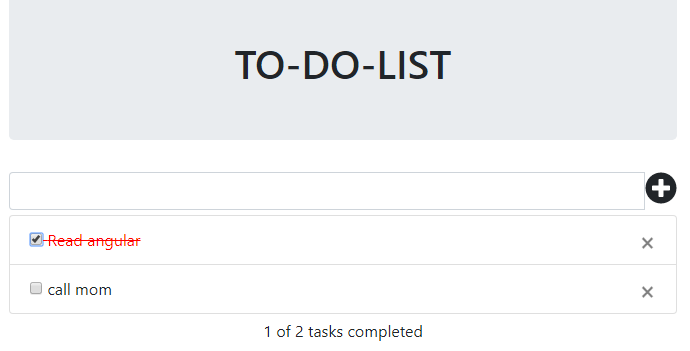

# To-Do-List in angular and bootstrap
This is a simple component for building a to-do-list using angular and bootstrap. You can add all your task in this list and click the box when You completed a specific task.

<p align="center">
    
</p>
For preview , [Click here](https://stackblitz.com/edit/angular-c3k3vm?embed=1&file=app/list/list.component.html)


## Using the project

Download the to-do-list folder and install the required packages and run the application. 

### Installing

```
> npm install
```

### Run server

```
> ng serve
```


## Adding a new task
Write the task you want to do and click on the plus button then your mentioned task will be added to your task list. 

## Removing a task 
Click on the close button and it will be deleted. 

## Marking completed
Check the box when you completed the task and it will sort your whole list. It can also accept an array of lists from user and display. 
 

## @Input Decorator
 
@Input has been used to receive input from user.User will pass an array containing 'id','desc' and 'status' and it will be added to the list.

  <list [userList]="lists" (mylist)="getList($event)"></list>
  
  userList is the input for to-do-list of type List.
  
  ### List Interface

```typescript

List {
  id: number;
  desc: string;
  status: boolean;
}
  
  
  
  lists is an array of objects what user will give.
  
  
  Ex:-
  {'id':1,'desc':'angular','status':false}
  
## @Output Decorator

@Output has been used to provide user with required output.For this i have used EventEmitter.

getList(lists){

       for(let i=0;i<lists.length;i++){
       
      console.log(lists[i].desc);
    }
   
  }
  
 
 This method will give all the lists.
  
  <list [userList]="lists" (mylist)="getList($event)"></list>
  
  
  mylist is the output event name I have used.

